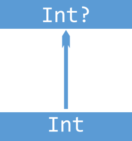
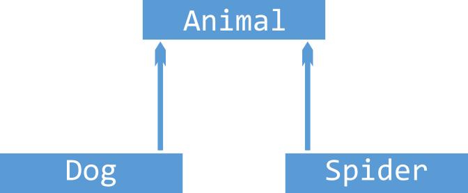
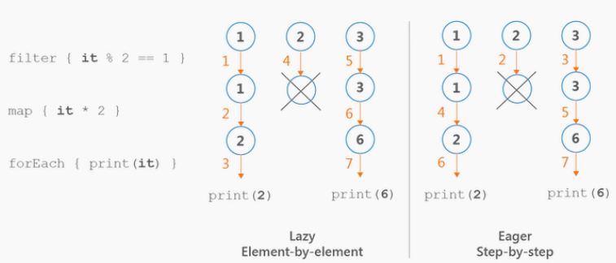
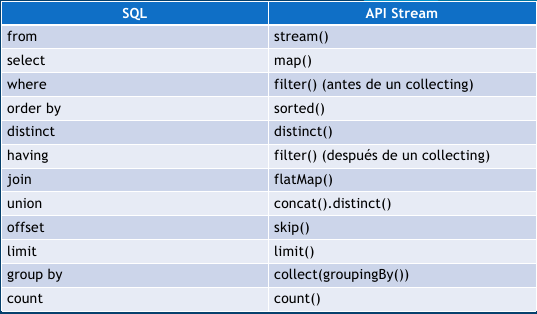

# Programación - 06 Tipos Genéricos, Abstractos y Colecciones

Tema 06 Tipos Genéricos, Abstractos y Colecciones. 1DAM. Curso 2022/2023.


- [Programación - 06 Tipos Genéricos, Abstractos y Colecciones](#programación---06-tipos-genéricos-abstractos-y-colecciones)
  - [Contenidos](#contenidos)
  - [Tipos Genéricos](#tipos-genéricos)
    - [Tipos y subtipos](#tipos-y-subtipos)
    - [Varianza](#varianza)
    - [Invarianza](#invarianza)
    - [Covarianza](#covarianza)
    - [Contravarianza](#contravarianza)
    - [Proyectividad](#proyectividad)
    - [Acotaciones](#acotaciones)
  - [Tipos de Datos Abstractos](#tipos-de-datos-abstractos)
    - [Pair y Triple](#pair-y-triple)
  - [Colecciones](#colecciones)
  - [Listas, Pilas y Colas](#listas-pilas-y-colas)
    - [Listas](#listas)
    - [Pilas](#pilas)
    - [Colas](#colas)
  - [Comparadores](#comparadores)
    - [Comparable](#comparable)
    - [Comparator](#comparator)
  - [Conjuntos](#conjuntos)
  - [Mapas](#mapas)
  - [Operaciones con colecciones](#operaciones-con-colecciones)
    - [Operaciones de filtrado](#operaciones-de-filtrado)
    - [Operaciones con operadores](#operaciones-con-operadores)
    - [Operaciones de transformación](#operaciones-de-transformación)
    - [Operaciones de búsqueda](#operaciones-de-búsqueda)
    - [Obtener subcolecciones](#obtener-subcolecciones)
    - [Operaciones de ordenación](#operaciones-de-ordenación)
    - [Operaciones de agrupación](#operaciones-de-agrupación)
    - [Operaciones de agregación](#operaciones-de-agregación)
  - [Secuencias](#secuencias)
    - [Creación de secuencias](#creación-de-secuencias)
    - [Operaciones](#operaciones)
    - [Operaciones con secuencias](#operaciones-con-secuencias)
    - [Iterables vs Secuencias](#iterables-vs-secuencias)
  - [Operaciones con Colecciones y SQL](#operaciones-con-colecciones-y-sql)
  - [Optional](#optional)
  - [Formateadores y Localización](#formateadores-y-localización)
  - [Otros ejemplos](#otros-ejemplos)
  - [Recursos](#recursos)
  - [Autor](#autor)
    - [Contacto](#contacto)
    - [¿Un café?](#un-café)
  - [Licencia de uso](#licencia-de-uso)


## Contenidos
1. Tipos Genéricos
2. Tipos de Datos Abstractos
3. Introducción a las Colecciones
4. Listas, Pilas y Colas
5. Comparadores
6. Conjuntos
7. Mapas
8. Operaciones con Colecciones: Filtrado, Mapeado, Agrupado, Ordenado, etc.
9. Secuencias
10. Optional
11. Formateadores y Localización

## Tipos Genéricos
Los tipos genéricos son una forma de reutilizar código, permitiendo que los tipos de datos sean variables. Esto nos permite crear clases, interfaces y métodos que pueden operar con objetos de diferentes tipos, siempre y cuando estos objetos sean compatibles con los parámetros de tipo.

En Kotlin los tipos genéricos se definen con la palabra clave **`<T>`**. Aunque el identificador del tipo genérico puede ser cualquier letra o palabra.

Por ejemplo, si queremos crear una clase que represente una caja de cualquier tipo, podemos hacerlo de la siguiente manera:

```kotlin
class Caja<T>(t: T) {
    var valor = t

    fun obtener(): T {
        return valor
    }

    fun mostrar() {
        println(valor.toString())
    }
}

fun main() {
    val cajaEntero = Caja(10)
    val cajaCadena = Caja("Hola")
    val cajaBooleano = Caja(true)

    cajaEntero.mostrar()
    cajaCadena.mostrar()
    cajaBooleano.mostrar()
}
```

### Tipos y subtipos
Un subitipo es un tipo que hereda de otro tipo. Por ejemplo, Profesor hereda de Persona, por lo que podemos asignar un objeto de tipo Profesor a una variable de tipo Persona. Esto se conoce como subtipado. Pero al contrario no es posible. Esto además debería casar con el principio de sustitución de Liskov y aplicando otros elementos como herencia y polimorfismo.

```kotlin
open class Persona(val nombre: String)
class Profesor(nombre: String, val materia: String) : Persona(nombre)

fun main() {
    val persona: Persona = Profesor("Pepe", "Matemáticas")
    println(persona.nombre)
}
```

### Varianza
La varianza es una propiedad que tienen los tipos genéricos que nos permite definir si un tipo genérico es invariante, covariante o contravariante. Es decir, si un tipo genérico puede ser sustituido por otro tipo genérico de la misma familia. Lamentablemente no se cumple el pricipio visto en el ejemplo anterior.

Veamos este ejemplo

  

```kotlin
val integer: Int = 1
val number: Number = integer // Esto es posible porque Int es subtipo de Number
val integer: Int = 1;
val nullableInteger: Int? = integer; // Esto es posible porque Int? es subtipo de Int
```

```kotlin
abstract class Animal(val size: Int)
class Dog(val cuteness: Int): Animal(100)
class Spider(val terrorFactor: Int): Animal(1)

fun main() {
    val dog: Dog = Dog(10)
    val spider: Spider = Spider(9000)
    val animal: Animal = dog // Esto es posible porque Dog es subtipo de Animal
    animal = spider // Esto es posible porque Spider es subtipo de Animal
}
```

Lamentablemente cuando estamos con genéricos esto no siempre es posible. Veamos un ejemplo

```kotlin
integerList = mutableListOf(1, 2, 3) 
numberList: MutableList<Number> = integerList; // esto no es posible porque List<Int> no es subtipo de List<Number>
```

Debemos tener en cuenta que los tipos genéricos son invariantes por defecto. Esto es debido a que se puede producir y consumir tipos y que estas colecciones sun mutables. 
Esto quiere decir que no podemos asignar un tipo genérico a otro tipo genérico de la misma familia superior. Para poder hacerlo debemos indicar que el tipo genérico es covariante o contravariante. Para ello debemos indicar la palabra clave **`out`** o **`in`** respectivamente.

***IMPORTANTE***: 
- Colecciones Mutables es invariante con respecto a su tipo genérico. (no podemos ni consumir ni producir/añadir valores con un tipo más genérico)
- Colecciones Inmutables es covariante con respecto a su tipo genérico (podemos consumir sus valores con un tipo más genérico)

¿Qué significa consumir (covarianza) y qué producir (contravarianza)?
- Consumir implica tener funciones que devuelven un valor del tipo genérico
- Producir implica tener funciones que reciben por argumento un objeto del tipo genérico

### Invarianza
La invarianza nos indica que un tipo no puede ser usado en un contexto donde se espera otro tipo. Es la usada por defecto en colecciones mutables tal y como hemos visto.


```kotlin
val integerList: MutableList<Int> = mutableListOf(1, 2, 3)
val numberList: MutableList<Number> = integerList // Esto no es posible porque MutableList<Int> no es subtipo de MutableList<Number>

al dogList: MutableList<Dog> = mutableListOf(Dog(10), Dog(20), Dog(30))
val animalList: MutableList<Animal> = dogList // Esto no es posible porque MutableList<Dog> no es subtipo de MutableList<Animal>
```
    
```kotlin
// Invariante: No sabemos si vamos a consumir o producir, por lo que no podemos usarlo en un contexto donde se espera otro tipo
class EncrypterInvariante<T>(val item: T) {
    fun encrypt(): T {
        return item
    }

    fun decrypt(item: T) {
        println(item.toString())
    }
}

val e: EncrypterInvariante<Int> = EncrypterInvariante(10)
val e2: EncrypterInvariante<Number> = e // Por defecto es invariante, no es posible

```

### Covarianza
La covarianza es la es la capacidad de un tipo de ser usado en un contexto donde se espera un tipo más general. Aparece directamente si las colecciones son inmutables. Además, si queremos detallarlo en otras debemos indicar la palabra clave **`out`**. Por ejemplo, si queremos que una lista de perros pueda ser usada como una lista de animales. Para ello el tipo genérico solo debe aparecer como elemento de salida de una función o como tipo de retorno de una función.


```kotlin
val dogList: List<Dog> = listOf(Dog(10), Dog(20))
val animalList: List<Animal> = dogList // Esto es posible porque List<Dog> es subtipo de List<Animal> Inmutable
```

Otro ejemplo usando out para especificarlo con colecciones mutables o si sabemos con seguridad que no vamos a producir valores, solo consumirlos.

```kotlin
// Covariante: Nosotros aseguramos que solo vamos a consumir con el generico
//  usamos out, es decir, solo vamos a consumir, no producir
// el generico esta en la devolución de las funciones
class EncrypterCovariante<out T>(val item: T) {
    fun metodo(): T {
        return item
    }
}

// si sabemos que solo vamos a consumir, podemos permitirlo
// el generico solo esta en los devolución de las funciones
// EncrypterCovariante<Number> <- EncrypterCovariante<Int>  OK // Covariante, porque solo consumimos
val e3: EncrypterCovariante<Int> = EncrypterCovariante(10)
val e4: EncrypterCovariante<Number> = e3

```

### Contravarianza
La contravarianza es la capacidad de un tipo de ser usado en un contexto donde se espera un tipo más específico. Además, si queremos detallarlo debemos indicar la palabra clave **`in`**. Por ejemplo, si queremos que una lista de animales pueda ser usada como una lista de perros. Para ello el tipo genérico solo debe aparecer como elemento de entrada de una función o como tipo de argumento de una función.


```kotlin
val dogCompare: Compare<Dog> = object: Compare<Dog> {
  override fun compare(first: Dog, second: Dog): Int {
    return first.cuteness - second.cuteness
  }
}

val animalCompare: Compare<Animal> = dogCompare // Esto no es posible porque Compare<Dog> no es subtipo de Compare<Animal>!!!

val animalCompare: Compare<Animal> = object: Compare<Animal> {
  override fun compare(first: Animal, second: Animal): Int {
    return first.size - second.size
  }
}
val spiderCompare: Compare<Spider> = animalCompare // Esto es posible porque Compare<Animal> es subtipo de Compare<Spider> Contravariante!!
```
```kotlin
// Contravariante: Nosotros aseguramos que solo vamos a producir con el generico
// usamos int, es decir, solo vamos a producir (usarlo como parametro), no consumir (devolver)
// el genérico esta en los parámetros de las funciones
class EncrypterContravariante<in T>() {
    fun metodo(item: T): String {
        return "Hola"
    }
}

// si sabemos que solo vamos a producir, podemos permitirlo
// Es decir el genérico solo esta en las parametros de las funciones
// EncrypterContravariante<Int> <- EncrypterContravariante<Out>  OK // Contravariante, porque solo producimos
val e5: EncrypterContravariante<Number> = EncrypterContravariante()
val e6: EncrypterContravariante<Int> = e5
```

```kotlin
interface ComparableInvariante<T> {
    fun compare(other: T): Int
}

// Esto va a dar error, ya que no hemos definido el tipo de varianza, y por tanto el tipo aquí es invariante: si no indicamos la varianza,
// no podemos convertir un Comparable<Number> en un Comparable<Float>.
fun testInvariante(comparable: ComparableInvariante<Number>) {
    val comp: ComparableInvariante<Float> = comparable // Error 
}

interface ComparableContravariante<in T> {
    fun compare(other: T): Int
}


// Tiene sentido que puedas hacerlo, ya que si el Comparable permite comparar Numbers,
// comparar con Floats es un subconjunto de lo que este tipo te deja hacer.
fun testCotravariante(comparable: ComparableContravariante<Number>) {
    val comp: ComparableContravariante<Float> = comparable
}
```

### Proyectividad
La proyección de un tipo genérico es el tipo de los objetos que se pueden obtener de él. Uso array porque se puede consumir y producir(get y set) y queremos especificar el manejo de la varianza

```kotlin

// Copiar Array of Subtipos a un Array of Supertipos
// Array<out T> es un Array de T de solo lectura
// Out, cualquier cosa por encima de Any, es lo cumple Any?


fun copy1(from: Array<out Any>, to: Array<Any?>) {
    for (i in from.indices)
        to[i] = from[i]
}

// Añadir elementos de un subtipo a un Array de supertipo
// Array<in T> es un Array de T donde vamos a producir
// con in decimos que como máximo un Int
fun fill(dest: Array<in Int>, value: Int) {
    dest[0] = value
}

/*
Hay situaciones en las que no nos importa el tipo específico de valor.
Digamos que solo queremos imprimir todos los elementos de un Array y no importa cuál
sea el tipo de elementos en este Array.
 */

fun printArray(array: Array<*>) {
    array.forEach { println(it) }
}

fun main() {
    val ints = arrayOf(1, 2, 3)
    val any = arrayOfNulls<Any>(3)
    copy1(ints, any)
    println(any.contentToString())

    val objects: Array<Any?> = arrayOfNulls(1)
    fill(objects, 1)

    val array = arrayOf(1, 2, 3)
    printArray(array)
}
```

### Acotaciones
Podemos acotar los tipos de datos que se pueden usar en un tipo genérico. Esto se hace mediante la palabra reservada **where** o usando **:**.

```kotlin
// Se traga cualquier cosa
fun <T> imprimir(valor: T) {
    println(valor)
}

// si no queremos nulos en el generico
fun <T : Any> imprimirNoNulo(valor: T) {
    println(valor)
}

// Esto es lo que se conoce como acotacion y extensión del tipo genérico


interface IAnimal
interface IDog {
    fun ladrar()
}

sealed class Animal(val nombre: String) : IAnimal
class Dog(nombre: String, edad: Int) : Animal(nombre), IDog {
    override fun ladrar() {
        println("Guau")
    }
}

class Cat(nombre: String, color: String) : Animal(nombre)

class CanicheRabioso(nombre: String, edad: Int) : IDog {
    override fun ladrar() {
        println("Guau")
    }
}

// Se puede acotar el tipo genérico a una clase o interfaz
// Solo son válidos los tipos que implementen la interfaz o hereden de la clase

// T debe ser un Animal
fun <T : Animal> imprimirCosa(animal: T) {
    println(animal)
}

// T debe implementar la interfaz IAnimal
fun <T : IAnimal> imprimirICosa(animal: T) {
    println(animal)
}

// T debe implementar la interfaz IDog
fun <T : IDog> imprimirIDog(animal: T) {
    println(animal)
}

// T debe ser un Animal y además implementar la interfaz IDog
fun <T> imprimirAnimal(animal: T) where T : Animal, T : IDog {
    println(animal)
}

```

## Tipos de Datos Abstractos
Los tipos de datos abstractos (TDA) son una forma de definir tipos de datos que se pueden usar en un programa. Un TDA es una estructura de datos que se define mediante un conjunto de operaciones que se pueden realizar sobre ella. Los TDA son una forma de encapsular datos y operaciones sobre ellos. Los TDA son una forma de encapsular datos y operaciones sobre ellos.

```kotlin
// Definición de un TDA
class TDA {
    // Atributos
    var atributo1: Int = 0
    var atributo2: String = ""
    // Métodos
    fun metodo1() {
        // Código
    }
    fun metodo2() {
        // Código
    }
}
```

### Pair y Triple
Kotlin nos proporciona dos clases para poder trabajar con pares y triples de datos. Estas clases son Pair y Triple. Estas clases son inmutables. Son muy útiles para devolver varios valores de una función. En el fondo son data classes que trabajan con pares y triples de datos genéricos.

```kotlin
// Pair
val pair = Pair(1, "Hola")
println(pair.first) // 1
println(pair.second) // Hola

// Triple
val triple = Triple(1, "Hola", 3.14)
println(triple.first) // 1
println(triple.second) // Hola
println(triple.third) // 3.14
```

## Colecciones
Las colecciones son TDAs que nos permiten poder manipular datos.

En Kotlin tenemos 3 tipos de colecciones:
- Listas: Colecciones de datos ordenadas y con acceso aleatorio.
- Conjuntos: Colecciones sin elementos repetidos.
- Mapas: Colecciones de pares clave-valor.

Además de estas colecciones tenemos las colecciones inmutables y mutables.
- Inmutables: No se pueden modificar una vez creadas.
- Mutables: Se pueden modificar una vez creadas.


## Listas, Pilas y Colas
### Listas
La lista es una colección de datos ordenados y con acceso aleatorio y en base a un índice usando el operador **[]**. Las listas son inmutables por defecto. Para poder crear una lista mutable debemos usar la función mutableListof().

```kotlin
// Lista inmutable
val lista = listOf(1, 2, 3, 4, 5)
println(lista[0]) // 1
println(lista[1]) // 2
println(lista[2]) // 3

// Lista mutable
val listaMutable = mutableListOf(1, 2, 3, 4, 5)
listaMutable[0] = 10
println(listaMutable[0]) // 10

// Lista de objetos
val listaObjetos = listOf(
    Dog("Firulais", 3),
    Dog("Rex", 5),
    Dog("Lassie", 7)
)

// Acceso a los elementos
println(listaObjetos[0].nombre) // Firulais
println(listaObjetos[1].nombre) // Rex
println(listaObjetos[2].nombre) // Lassie

// Listas de objetos con tipos genéricos
val listaObjetosGenericos = listOf<Dog>(
    Dog("Firulais", 3),
    Dog("Rex", 5),
    Dog("Lassie", 7)
)

// O fijando el tipo de dato
val listaObjetosGenericos2: MutableList<Dog> = mutableListOf(
    Dog("Firulais", 3),
    Dog("Rex", 5),
    Dog("Lassie", 7)
)

// Podemos inicializar una lista vacía
val listaVacia = mutableListOf<Dog>() // es mutable
// o de esta manera 
val listaVacia = emptyList<Dog>() // es inmutable
```

### Pilas
La pila es una colección de datos ordenados y con acceso LIFO (Last In First Out). Es decir, el último elemento que se introduce es el primero que se saca. Las operaciones que podemos realizar con una pila a nivel teórico son:
- push(): Añade un elemento a la pila.
- pop(): Saca un elemento de la pila.
- peek(): Devuelve el elemento que está en la cima de la pila sin sacarlo.

Podemos implementar una pila con una lista mutable o con ArrayDeque. ArrayDeque es una clase que implementa la interfaz Deque que es una interfaz que implementan las clases que implementan colas y pilas.
```kotlin
// Implementación con lista mutable
val pila = mutableListOf(1, 2, 3, 4, 5)
pila.add(6) // push
pila.removeAt(pila.size - 1) // pop
pila.removeLast() // pop (más eficiente)
println(pila.last()) // peek
println(pila) // [1, 2, 3, 4]

// Implementación con ArrayDeque
val stack = ArrayDeque<Int>()
stack.addLast(1) // push
stack.addLast(2) // push
stack.addLast(3) // push
stack.removeLast() // pop
println(stack.last()) // peek
println(stack) // [2, 1]
```

### Colas
Las colas son una colección de datos ordenados y con acceso FIFO (First In First Out). Es decir, el primer elemento que se introduce es el primero que se saca. Las operaciones que podemos realizar con una cola a nivel teórico son:
- enqueue(): Añade un elemento a la cola.
- dequeue(): Saca un elemento de la cola.
- first(): Devuelve el primer elemento de la cola sin sacarlo.

En Kotlin podemos implementar una cola con una lista mutable o con ArrayDeque. ArrayDeque es una clase que implementa la interfaz Deque que es una interfaz que implementan las clases que implementan colas y pilas.
```kotlin
// Implementación con lista mutable
val cola = mutableListOf(1, 2, 3, 4, 5)
cola.add(6) // encola  al final
cola.removeAt(0) // desencola al principio
cola.removeFirst() // desencola al principio (más eficiente)
println(cola.first()) // muestra el primer elemento
println(cola) // [3, 4, 5, 6]

// Implementación con ArrayDeque
val deque = ArrayDeque<Int>()
deque.addLast(1)
deque.addLast(2)
deque.addLast(3)
println(deque) // [1, 2, 3]
deque.removeFirst()
deque.removeFirst()
println(deque) // [3]
```

## Comparadores
Los comparadores son una interfaz que nos permite comparar objetos. En Kotlin podemos implementar esta interfaz de dos maneras:
- Implementando la interfaz Comparable.
- Implementando la interfaz Comparator.


### Comparable
La interfaz Comparator nos permite implementar una función de comparación entre dos objetos. Esta función de comparación nos devuelve un entero que nos indica si el primer objeto es menor, igual o mayor que el segundo objeto. Si devuelve un número negativo, el primer objeto es menor que el segundo. Si devuelve 0, los objetos son iguales. Si devuelve un número positivo, el primer objeto es mayor que el segundo. Si son tipos de Kotlin, podemos usar el propio método comparteTo que tienen.

Se suele usar como comparación por defecto en las colecciones de objetos. Por ejemplo, si tenemos una lista de objetos de tipo Persona, podemos ordenarla por nombre de la siguiente manera:
```kotlin
data class Persona(val nombre: String, val edad: Int): Comparator<Persona> {
    override fun compareTo(other: Persona): Int {
        return this.nombre.compareTo(other.nombre)
    }
}

// Comparamos por nombre
val listaPersonas = listOf(
    Persona("Juan", 20),
    Persona("Ana", 25),
    Persona("Luis", 30)
)

// Ordenamos por nombre
if (listaPersonas[0].compareTo(listaPersonas[1]) < 0) {
    println("El primero es menor que el segundo")
} else if (listaPersonas[0].compareTo(listaPersonas[1]) == 0) {
    println("El primero es igual que el segundo")
} else {
    println("El primero es mayor que el segundo")
}
```

### Comparator
La interfaz Comparator nos permite implementar una función de comparación entre dos objetos. Esta función de comparación nos devuelve un entero que nos indica si el primer objeto es menor, igual o mayor que el segundo objeto. Si devuelve un número negativo, el primer objeto es menor que el segundo. Si devuelve 0, los objetos son iguales. Si devuelve un número positivo, el primer objeto es mayor que el segundo. Si son tipos de Kotlin, podemos usar el propio método comparteTo que tienen.

Se suele para implementar distintas ordenaciones o ordenaciones sobre la marcha, con un labda, según necesidades. Por ejemplo, si tenemos una lista de objetos de tipo Persona, podemos ordenarla por nombre de la siguiente manera:
```kotlin
data class Persona(val nombre: String, val edad: Int) 

// comparator por nombre
val comparatorNombre = Comparator<Persona> { p1, p2 ->
    p1.nombre.compareTo(p2.nombre)
}

// comparator por edad descendente
val comparatorEdad = Comparator<Persona> { p1, p2 ->
    p2.edad.compareTo(p1.edad)
}
```

## Conjuntos
Los conjuntos son una colección de datos sin elementos repetidos. En Kotlin podemos implementar un conjunto usando Set.

Tenemos distintos tipos:
- LinkedHashSet: Implementación de un conjunto con un orden de inserción.
- HashSet: Implementación de un conjunto sin orden de inserción, con orden de hash.
- TreeSet: Implementación de un conjunto ordenado: necesita que el tipo de dato sea Comparable o que se le pase un Comparator.

En java debes tener en cuenta que debes implementar HashCode y Equals en las clases que vayas a usar en un conjunto

```kotlin

val conjunto = setOf(1, 2, 3, 4, 5, 1, 1)
println(conjunto) // [1, 2, 3, 4, 5]

data class Persona(val nombre: String, val edad: Int): Comparable<Persona> {
    override fun compareTo(other: Persona): Int {
        return this.nombre.compareTo(other.nombre)
    }
}

val treePersonas = TreeSet<Persona>() // Usa el compareTo de Persona

treePersonas.add(Persona("Juan", 20))
treePersonas.add(Persona("Ana", 25))
treePersonas.add(Persona("Luis", 30))

println(treePersonas) // [Persona(nombre=Ana, edad=25), Persona(nombre=Juan, edad=20), Persona(nombre=Luis, edad=30)]


val treePersonas = TreeSet<Persona>(comparatorEdad) // Usa el comparatorEdad de Persona
val treePersonas = TreeSet<Persona>() { p1, p2 -> p1.edad.compareTo(p2.edad) } // Comparador sobre la marcha con lambda
```

***TRUCO***: Si queremos una lista ordenada, podemos usar un TreeSet y convertirlo a lista. Si queremos una lista sin elementos repetidos, podemos usar un LinkedHashSet y convertirlo a lista.

```kotlin
val lista = listOf(1, 7, 3, 4, 5, 1, 1, 2)
val listaSinRepetidos = lista.toSet().toList()
println(listaSinRepetidos) // [1, 7, 3, 4, 5, 2]
```

## Mapas
Un mapa es una colección de datos que se almacenan en pares clave-valor. En Kotlin podemos implementar un mapa usando Map. Todas las claves son únicas, pero los valores pueden repetirse y las operaciones se realizan sobre las claves.

Tenemos distintos tipos:
- LinkedHashMap: Implementación de un mapa con un orden de inserción.
- HashMap: Implementación de un mapa sin orden de inserción, con orden de hash.
- TreeMap: Implementación de un mapa ordenado: necesita que el tipo de dato sea Comparable o que se le pase un Comparator.

```kotlin
val mapa = mapOf(
    1 to "Uno",
    2 to "Dos",
    3 to "Tres"
)

println(mapa) // {1=Uno, 2=Dos, 3=Tres}
```
Podemos acceder a sus claves, valores o pares:
```kotlin
println(mapa.keys) // [1, 2, 3]
println(mapa.values) // [Uno, Dos, Tres]
println(mapa.entries) // [1=Uno, 2=Dos, 3=Tres]
```

Podemos acceder a sus elementos de distintas formas:
```kotlin
println(mapa[1]) // Uno
println(mapa.get(1)) // Uno
println(mapa.getOrDefault(4, "No existe")) // No existe
```

Podemos recorrerlos de distintas formas:
```kotlin
for (clave in mapa.keys) {
    println(clave)
}

for (valor in mapa.values) {
    println(valor)
}

for (par in mapa.entries) {
    println(par)
}

for ((clave, valor) in mapa) {
    println("$clave -> $valor")
}
```

Podemos añadir elementos:
```kotlin
val mapa = mutableMapOf(
    1 to "Uno",
    2 to "Dos",
    3 to "Tres"
)

mapa.put(4, "Cuatro")
mapa[5] = "Cinco"

println(mapa) // {1=Uno, 2=Dos, 3=Tres, 4=Cuatro, 5=Cinco}
``` 

Podemos eliminar elementos:
```kotlin
val mapa = mutableMapOf(
    1 to "Uno",
    2 to "Dos",
    3 to "Tres"
)

mapa.remove(1)
```
Podemos comprobar si existe un elemento:
```kotlin
val mapa = mutableMapOf(
    1 to "Uno",
    2 to "Dos",
    3 to "Tres"
)

println(mapa.containsKey(1)) // true
println(mapa.containsValue("Uno")) // true
```

Podemos ordenarlos usando un TreeMap:
```kotlin
val mapa = mutableMapOf(
    1 to "Uno",
    2 to "Dos",
    3 to "Tres"
)

val treeMapa = TreeMap<Int, String>(mapa) // Ordena por clave usando el compareTo (Comparable) de Int

println(treeMapa) // {1=Uno, 2=Dos, 3=Tres}

// Podemos asignar un Comparator sobre la marcha
val treeMapa = TreeMap<Int, String>(mapa) { k1, k2 -> k2.compareTo(k1) }
println(treeMapa) // {3=Tres, 2=Dos, 1=Uno}

```

## Operaciones con colecciones

### Operaciones de filtrado
- filter: Filtra los elementos de una colección que cumplan una condición. Devuelve una nueva colección. Tenemos: filter, filterNot, filterNotNull, filterIsInstance, filterIndexed,filterKeys, filterValues.
```kotlin
val lista = listOf(1, 7, 3, 4, 5, 1, 1, 2)
val listaFiltrada = lista.filter { it > 3 }
println(listaFiltrada) // [7, 4, 5, 2]
```

- partition: Divide una colección en dos colecciones, una con los elementos que cumplen una condición y otra con los que no la cumplen.
```kotlin
val lista = listOf(1, 7, 3, 4, 5, 1, 1, 2)
val (listaFiltrada, listaNoFiltrada) = lista.partition { it > 3 }
println(listaFiltrada) // [7, 4, 5, 2]
println(listaNoFiltrada) // [1, 3, 1, 1]
```

- test predicate: Comprueba si todos, alguno o ningún elemento de una colección cumplen una condición. Devuelve un booleano. Tenemos: all, any y none.
```kotlin
val lista = listOf(1, 7, 3, 4, 5, 1, 1, 2)
println(lista.all { it > 3 }) // false
println(lista.any { it > 3 }) // true
println(lista.none { it > 3 }) // false
```

### Operaciones con operadores

- plus: Concatena dos colecciones. Devuelve una nueva colección.
```kotlin
val lista = listOf(1, 2, 3, 4)
val lista2 = listOf(5, 6, 7, 8)
val lista3 = lista + lista2
println(lista3) // [1, 2, 3, 4, 5, 6, 7, 8]
```

- minus: Elimina los elementos de una colección que se encuentran en otra. Devuelve una nueva colección.
```kotlin
val lista = listOf(1, 2, 3, 4, 5, 6, 7, 8)
val lista2 = listOf(1, 2, 3, 4, 5)
val lista3 = lista - lista2
println(lista3) // [6, 7, 8]
```

- intersect: Devuelve una nueva colección con los elementos que se encuentran en ambos conjuntos/listas.
```kotlin
val set = setOf(1, 2, 3, 4, 5, 6, 7, 8)
val set2 = setOf(1, 2, 3, 4, 5)
val set3 = set.intersect(set2)
println(set3) // [1, 2, 3, 4, 5]
```

- union: Devuelve una nueva colección con los elementos de ambos conjuntos/listas.
```kotlin
val set = setOf(1, 2, 3, 4, 5, 6, 7, 8)
val set2 = setOf(1, 2, 3, 4, 5)
val set3 = set.union(set2)
println(set3) // [1, 2, 3, 4, 5, 6, 7, 8]
```
- subtract: Devuelve una nueva colección con los elementos que se encuentran en el primer conjunto/lista y no en el segundo.
```kotlin
val set = setOf(1, 2, 3, 4, 5, 6, 7, 8)
val set2 = setOf(1, 2, 3, 4, 5)
val set3 = set.subtract(set2)
println(set3) // [6, 7, 8]
```

### Operaciones de transformación
- map: Transforma los elementos de una colección. Devuelve una nueva colección. Tenemos: map, mapNotNull, mapIndexed, mapIndexedNotNull, mapKeys, mapValues...
```kotlin
val lista = listOf(1, 2, 3, 4, 5, 6, 7, 8)
val lista2 = lista.map { it * 2 }
println(lista2) // [2, 4, 6, 8, 10, 12, 14, 16]

val listPalabras = listOf("Hola", "que", "tal")
val listPalabrasMayus = listPalabras.map { it.upperCase() }
```

- zip: Une dos colecciones en una colección de pares. Devuelve una nueva colección.
```kotlin
val lista = listOf(1, 2, 3, 4, 5, 6, 7, 8)
val lista2 = listOf("Uno", "Dos", "Tres", "Cuatro", "Cinco", "Seis", "Siete", "Ocho")
val lista3 = lista.zip(lista2)
println(lista3) // [(1, Uno), (2, Dos), (3, Tres), (4, Cuatro), (5, Cinco), (6, Seis), (7, Siete), (8, Ocho)]
```

- associate: Transforma una colección en un mapa. Devuelve un nuevo mapa. Tenemos: associate, associateBy (elementos son los valores), associateWith (elemento es la clave).
```kotlin
val lista = listOf(1, 2, 3, 4, 5, 6, 7, 8)
val mapa = lista.associate { it to it * 2 }
println(mapa) // {1=2, 2=4, 3=6, 4=8, 5=10, 6=12, 7=14, 8=16}
```

- flatten: Transforma una colección de colecciones en una colección. Devuelve una nueva colección.
```kotlin
val lista = listOf(listOf(1, 2, 3), listOf(4, 5, 6), listOf(7, 8, 9))
val lista2 = lista.flatten()
println(lista2) // [1, 2, 3, 4, 5, 6, 7, 8, 9]
```

- flatMap: Transforma una colección de colecciones en una colección. Devuelve una nueva colección. Es similar a map y flatten.
```kotlin
val lista = listOf(listOf("Hola", "que", "tal"), listOf("¿Cómo", "estás?"))
val lista2 = lista.flatMap { it.asReversed() } // hace el map como reverse y luego el flatten para unir las listas
println(lista2) // [tal, que, Hola, estás?, Cómo, ¿Cómo]
```

- joinToString: Devuelve una cadena con los elementos de la colección separados por un separador.
```kotlin
val numbers = (1..100).toList()
println(numbers.joinToString(separator = " | ", prefix = "start: ", postfix = ": end", limit = 10, truncated = "<...>"))
```

### Operaciones de búsqueda
- find: Devuelve el primer elemento que cumple la condición. Devuelve un elemento o null.
```kotlin
val lista = listOf(1, 2, 3, 4, 5, 6, 7, 8)
val elemento = lista.find { it > 5 }
println(elemento) // 6
```

- first/find: Devuelve el primer elemento de la colección que cumple la condición.
```kotlin
val numbers = listOf("one", "two", "three", "four", "five", "six")
println(numbers.first { it.length > 3 })
```

- last/findLast: Devuelve el último elemento de la colección que cumple la condición.
```kotlin
val numbers = listOf("one", "two", "three", "four", "five", "six")
println(numbers.last { it.startsWith("f") })
```

- random: Devuelve un elemento aleatorio de la colección.
```kotlin
val numbers = listOf("one", "two", "three", "four", "five", "six")
println(numbers.random()) // "four"
```

- indexOf: Devuelve el índice del primer elemento que cumple la condición o se le pasa. indexOFirst devuelve el índice del primer elemento que cumple la condición o se le pasa. indexOfLast devuelve el índice del último elemento que cumple la condición o se le pasa.
```kotlin
val numbers = listOf("one", "two", "three", "four", "five", "six")
println(numbers.indexOf("four")) // 3
```

- contains: Devuelve true si la colección contiene el elemento.
```kotlin
val numbers = listOf("one", "two", "three", "four", "five", "six")
println(numbers.contains("four")) // true
```

- in: Devuelve true si la colección contiene el elemento.
```kotlin
val numbers = listOf("one", "two", "three", "four", "five", "six")
println("four" in numbers) // true
```

- binarySearch: Devuelve el índice del elemento buscado usando la búsqueda binaria. Si no lo encuentra devuelve el índice negativo del elemento inmediatamente posterior al buscado.
```kotlin
val numbers = mutableListOf("one", "two", "three", "four")
numbers.sort()
println(numbers)
println(numbers.binarySearch("two"))  // 3
println(numbers.binarySearch("z")) // -5
println(numbers.binarySearch("two", 0, 2))  // -3
```


### Obtener subcolecciones
- slice: Devuelve una subcolección de los elementos indicados.
```kotlin
val numbers = listOf("one", "two", "three", "four", "five", "six")
println(numbers.slice(0..2)) // [one, two, three]
```

- take: Devuelve una subcolección de los primeros n elementos.
```kotlin
val numbers = listOf("one", "two", "three", "four", "five", "six")
println(numbers.take(3)) // [one, two, three]
```

- takeLast: Devuelve una subcolección de los últimos n elementos.
```kotlin
val numbers = listOf("one", "two", "three", "four", "five", "six")
println(numbers.takeLast(3)) // [four, five, six]
```

- takeWhile: Devuelve una subcolección de los elementos que cumplan la condición. Idem takeLastWhile.
```kotlin
val numbers = listOf("one", "two", "three", "four", "five", "six")
println(numbers.takeWhile { !it.startsWith('f') }) // [one, two, three]
```

- drop: Devuelve una subcolección de los elementos excluyendo los primeros n elementos.
```kotlin
val numbers = listOf("one", "two", "three", "four", "five", "six")
println(numbers.drop(3)) // [four, five, six]
```

- dropLast: Devuelve una subcolección de los elementos excluyendo los últimos n elementos.
```kotlin
val numbers = listOf("one", "two", "three", "four", "five", "six")
println(numbers.dropLast(3)) // [one, two, three]
```

- dropWhile: Devuelve una subcolección de los elementos excluyendo los elementos que cumplan la condición. Idem dropLastWhile.
```kotlin
val numbers = listOf("one", "two", "three", "four", "five", "six")
println(numbers.dropWhile { !it.startsWith('f') }) // [four, five, six]
```

- chunked: Devuelve una lista de subcolecciones de tamaño n.
```kotlin
val numbers = listOf("one", "two", "three", "four", "five", "six")
println(numbers.chunked(2)) // [[one, two], [three, four], [five, six]]
```

- windowed: Devuelve una lista de subcolecciones de tamaño n con un desplazamiento de m.
```kotlin
val numbers = listOf("one", "two", "three", "four", "five", "six")
println(numbers.windowed(3, 2)) // [[one, two, three], [three, four, five], [five, six]]
```

- zipWithNext: Devuelve una lista de pares de elementos consecutivos.
```kotlin
val numbers = listOf("one", "two", "three", "four", "five", "six")
println(numbers.zipWithNext()) // [(one, two), (two, three), (three, four), (four, five), (five, six)]
```

### Operaciones de ordenación
- sorted: Devuelve una lista ordenada de los elementos de la colección. Usando el orden natural de los elementos. Para el orden inverso usar reversed o sortedDescending.
```kotlin
val numbers = listOf("one", "two", "three", "four", "five", "six")
println(numbers.sorted()) // [five, four, one, six, three, two]
```

- sortedBy: Devuelve una lista ordenada en base a la función pasada por parámetros y su orden natural. Para el orden inverso usar reversed o sortedByDescending.
```kotlin
val numbers = listOf("one", "two", "three", "four", "five", "six")
println(numbers.sortedBy { it.length }) // [one, two, six, four, five, three]
```

- sortedWith: Devuelve una lista ordenada en base a la función con el comparador a usar. Para el orden inverso usar reversed.
```kotlin
val numbers = listOf("one", "two", "three", "four", "five", "six")
println(numbers.sortedWith(compareBy { it.length })) // [one, two, six, four, five, three]
```

- reversed: Devuelve una lista con los elementos de la colección en orden inverso.
```kotlin
val numbers = listOf("one", "two", "three", "four", "five", "six")
println(numbers.reversed()) // [six, five, four, three, two, one]
```

- shuffled: Devuelve una lista con los elementos de la colección en orden aleatorio.
```kotlin
val numbers = listOf("one", "two", "three", "four", "five", "six")
println(numbers.shuffled()) // [five, two, six, one, four, three]
```

### Operaciones de agrupación
- groupBy: Devuelve un mapa con los elementos agrupados por la función pasada por parámetros.
```kotlin
val numbers = listOf("one", "two", "three", "four", "five", "six")
println(numbers.groupBy { it.first().toUpperCase() }) // {F=[four], O=[one], S=[six], T=[two, three]}
```

- groupingBy: Devuelve un mapa con los elementos agrupados por la función pasada por parámetros. Permite realizar operaciones de agregación y se ejecuta de manera perezosa.
```kotlin
val numbers = listOf("one", "two", "three", "four", "five", "six")
println(numbers.groupingBy { it.first().upperCase() }.eachCount()) // {F=1, O=1, S=1, T=2}
```

### Operaciones de agregación

- max: Devuelve el elemento máximo de la colección en base a la función pasada por parámetros. maxBy para función y maxWith para comparador y maxOf para varios.
```kotlin
val numbers = listOf("one", "two", "three", "four", "five", "six")
println(numbers.max { it.length }) // three
```

- min: Devuelve el elemento mínimo de la colección en base a la función pasada por parámetros. minBy para función y minWith para comparador y minOf para varios
```kotlin
val numbers = listOf("one", "two", "three", "four", "five", "six")
println(numbers.min { it.length }) // one
```

- sum: Devuelve la suma de los elementos de la colección, sumOf, en base a una función de selección.
```kotlin
val numbers = listOf(1, 2, 3, 4, 5, 6)
println(numbers.sum()) // 21
```

- average: Devuelve la media de los elementos de la colección.
```kotlin
val numbers = listOf(1, 2, 3, 4, 5, 6)
println(numbers.average()) // 3.5
```

- count: Devuelve el número de elementos de la colección o que cumplen una condición/predicado.
```kotlin
val numbers = listOf(1, 2, 3, 4, 5, 6)
println(numbers.count()) // 6
println(numbers.count { it % 2 == 0 }) // 3
```

- reduce: Devuelve el resultado de aplicar la función pasada por parámetros a los elementos de la colección. reduceRight para recorrer la colección de derecha a izquierda. reduceIndexed para recorrer la colección con el índice. reduceRightIndexed para recorrer la colección de derecha a izquierda con el índice. Equivalentes con orNull.
```kotlin
val numbers = listOf(1, 2, 3, 4, 5, 6)
println(numbers.reduce { total, next -> total + next }) // 21
```

- fold: Devuelve el resultado de aplicar la función pasada por parámetros a los elementos de la colección. Es similar a reduce, pero además se le pasa un valor inicial. foldRight para recorrer la colección de derecha a izquierda. foldIndexed para recorrer la colección con el índice. foldRightIndexed para recorrer la colección de derecha a izquierda con el índice. Equivalentes con orNull.
```kotlin
val numbers = listOf(1, 2, 3, 4, 5, 6)
println(numbers.fold(0) { total, next -> total + next }) // 21
```

## Secuencias
Las secuencias son una forma de procesar colecciones de datos de forma eficiente. Se basan en el concepto de lazy evaluation, es decir, que los datos se procesan a medida que se van necesitando. Esto permite que el procesamiento de grandes cantidades de datos sea mucho más eficiente que con las colecciones tradicionales. Además nos permiten crear colecciones infinitas.

### Creación de secuencias
- sequenceOf: Crea una secuencia a partir de los elementos pasados por parámetros.
```kotlin
val numbers = sequenceOf("one", "two", "three", "four", "five", "six")
println(numbers) // Sequence of one, two, three, four, five, six
```

- generateSequence: Crea una secuencia a partir de una función que se ejecuta hasta que devuelve null.
```kotlin
val numbers = generateSequence(0) { it + 1 }
println(numbers.take(10).toList()) // [0, 1, 2, 3, 4, 5, 6, 7, 8, 9]
```

- yield y yieldAll: crea una secuencia a partir de una función y devuelve el valor con estas funciones
```kotlin
val oddNumbers = sequence {
    yield(1)
    yieldAll(listOf(3, 5))
    yieldAll(generateSequence(7) { it + 2 })
}
println(oddNumbers.take(5).toList()) // [1, 3, 5, 7, 9]

// Fibonacci
val fibonacci = sequence {
    var terms = Pair(0, 1)
    while (true) {
        yield(terms.first)
        terms = Pair(terms.second, terms.first + terms.second)
    }
}
println(fibonacci.take(10).toList()) // [0, 1, 1, 2, 3, 5, 8, 13, 21, 34]

// Primos
fun isPrime(number: Int): Boolean {
    for (i in 2 until number) {
        if (number % i == 0) return false
    }
    return true
}
val primes = sequence {
    var number = 2
    while (true) {
        if (isPrime(number)) yield(number)
        number++
    }
}
println(primes.take(10).toList()) // [2, 3, 5, 7, 11, 13, 17, 19, 23, 29]
```

### Operaciones 
- Stateless: No almacenan datos en memoria. Ej: map, filter, take, drop, etc.
- Stateful: Almacenan datos en memoria. toList, sum, average, etc. Son conocidas como terminales.

### Operaciones con secuencias
Las mismas que con las colecciones, pero con la diferencia de que se ejecutan de forma perezosa, es decir, a medida que se van necesitando los datos.

### Iterables vs Secuencias
- Iterables: Se procesan todos los datos de una vez. Se usan cuando se tienen pocos datos o pocas operaciones. Se procesa en horizontal. Son avariciosas.
  
- Secuencias: Se procesan los datos a medida que se van necesitando. Se usan cuando se tienen muchos datos o muchas operaciones. Se procesa en vertical. Son perezosas.

```kotlin
val withIterator = (1..10)
    .filter { print("Filter: $it, "); it % 2 == 0 } // filter out the odd numbers
    .map { print("Mapping: $it, "); it * 2 } // multiply the remaining numbers by 2
    .take(3) // take the first 3 numbers
println()

// Filter: 1, Filter: 2, Filter: 3, Filter: 4, Filter: 5, Filter: 6, Filter: 7, Filter: 8, Filter: 9, Filter: 10,
// Mapping: 2, Mapping: 4, Mapping: 6, Mapping: 8, Mapping: 10,
// Take: 4, Take: 8, Take: 12,

println(withIterator) // [4, 8, 12]
```
|Operation (vertical/(horizontal/eager ➡)|Values|
|---|---|
|init|1, 2, 3, 4, 5, 6, 7, 8, 9, 10|
|filter{ it % 2 == 0 }|2, 4, 6, 8, 10 (filter cada elemento)|
|map { it * 2 } |4, 8, 12, 16, 20 (map cada elemento)|
|take(3)|4, 8, 12 (toma los 3 primeros valores)|


```kotlin
val withSequence = (1..10).asSequence()
    .filter { print("Filter: $it, "); it % 2 == 0 } // filter out the odd numbers
    .map { print("Mapping: $it, "); it * 2 } // multiply the remaining numbers by 2
    .take(3) // take the first 3 numbers
    .toList() // convert the sequence to a list
println()

// Filter: 1,
// Filter: 2, Mapping: 2, Take: 4
// Filter: 3, 
// Filter: 4, Mapping: 4, Take: 8
// Filter: 5,
// Filter: 6, Mapping: 6, Take: 12

println(withSequence) // [4, 8, 12]

```

|Operation (horizontal/lazy ⬇)|Values|
|---|---|
|init|1, 2, 3, 4, 5, 6, 7, 8, 9, 10|
|filter{ it % 2 == 0 }|2, 4, 6 (filter solo 1, 2, 3, 4, 5, 6)|
|map { it * 2 } |4, 8, 12 (map solo 2, 4, y 6)|
|take(3)|4, 8, 12 (toma los 3 primeros valores)|




## Operaciones con Colecciones y SQL
A continuación se muestran las operaciones que se pueden realizar con las colecciones y una comparación con las operaciones de SQL para ver la similitud entre ambas.



## Optional
Cuando trabajamos en Java, debido a que no podemos asegurar que un valor no sea nulo, tenemos que hacer comprobaciones de que no sea nulo, y si lo es, lanzar una excepción o devolver un valor por defecto. Al no estar en Kotlin y no tener la posibilidad de usar el tipo de dato nullable, tenemos que usar una clase que nos permita trabajar con valores nulos de forma segura y es la clase Optional.

Optional<T> es una clase que nos permite trabajar con valores nulos de forma segura. Es una clase que contiene un valor o no. Si contiene un valor, se puede acceder a él, y si no, se puede acceder a un valor por defecto o lanzar una excepción si no se quiere usar un valor por defecto o este no está presente. Se suele usar en bases de datos y en procesamiento de colecciones y datos con la API Stream.
```java
Optional<String> optionalString = Optional.of("Hello"); // Optional[Hello]
Optional<String> optionalNull = Optional.ofNullable(null); // Optional.empty
Optional<String> optional = Optional.empty(); // Optional.empty

// Obtenemos el valor
System.out.println(optionalString.get()); // Hello

// Si está presente
optionalString.ifPresent(System.out::println); // Hello
optionalString.ifPresentOrElse(System.out::println, () -> System.out.println("No value present")); // Hello
System.out.println(optionalString.orElse("No value present")); // Hello
System.out.println(optionalString.orElseGet(() -> "No value present")); // Hello

// Si no está presente
optionalNull.ifPresent(System.out::println); // No se ejecuta
optionalNull.ifPresentOrElse(System.out::println, () -> System.out.println("No value present")); // No value present
System.out.println(optionalNull.orElse("No value present")); // No value present

// lanza una excepción
System.out.println(optionalNull.orElseThrow(throw new RuntimeException("No value present"))); // No value present
```

## Formateadores y Localización
Podemos formatear las cadenas o stribg de salida aplicando un formato. Para ello, podemos usar la clase Formatter. Esta clase nos permite formatear cadenas de texto, números, fechas, etc. Para ello, podemos usar los métodos format() o printf().

```kotlin

fun LocalDate.toLocalDate(): String {
    return this.format(
        DateTimeFormatter
            .ofLocalizedDate(FormatStyle.SHORT).withLocale(Locale("es", "ES"))
    )
}

fun Double.toLocalMoney(): String {
    return NumberFormat.getCurrencyInstance(Locale("es", "ES")).format(this)
}

fun main() {
    val formatter = Formatter()
    formatter.format("Hello %s", "World")
    println(formatter) // Hello World

    val date = LocalDate.now()
    println(date.toLocalDate()) // 12/10/21

    val money = 1234.56
    println(money.toLocalMoney()) // 1.234,56 €
}

```

## Otros ejemplos
Parte de los ejemplos dell temario y ejemplo de este tema lo tienes disponible en este repositorio: [GitHub TDA-DAM](https://github.com/joseluisgs/TDA-DAM-2021-2022)


## Recursos
- Twitter: https://twitter.com/joseluisgonsan
- GitHub: https://github.com/joseluisgs
- Web: https://joseluisgs.github.io
- Discord del módulo: https://discord.gg/RRGsXfFDya
- Aula DAMnificad@s: https://discord.gg/XT8G5rRySU


## Autor

Codificado con :sparkling_heart: por [José Luis González Sánchez](https://twitter.com/joseluisgonsan)

[](https://twitter.com/joseluisgonsan)
[](https://github.com/joseluisgs)

### Contacto
<p>
  Cualquier cosa que necesites házmelo saber por si puedo ayudarte 💬.
</p>
<p>
 <a href="https://joseluisgs.github.io/" target="_blank">
        
    </a>  &nbsp;&nbsp;
    <a href="https://github.com/joseluisgs" target="_blank">
        
    </a> &nbsp;&nbsp;
        <a href="https://twitter.com/joseluisgonsan" target="_blank">
        
    </a> &nbsp;&nbsp;
    <a href="https://www.linkedin.com/in/joseluisgonsan" target="_blank">
        
    </a>  &nbsp;&nbsp;
    <a href="https://discordapp.com/users/joseluisgs#3560" target="_blank">
        
    </a> &nbsp;&nbsp;
    <a href="https://g.dev/joseluisgs" target="_blank">
        
    </a>    
</p>

### ¿Un café?
<p><a href="https://www.buymeacoffee.com/joseluisgs"> </a></p><br><br><br>

## Licencia de uso

Este repositorio y todo su contenido está licenciado bajo licencia **Creative Commons**, si desea saber más, vea la [LICENSE](https://joseluisgs.github.io/docs/license/). Por favor si compartes, usas o modificas este proyecto cita a su autor, y usa las mismas condiciones para su uso docente, formativo o educativo y no comercial.

<a rel="license" href="http://creativecommons.org/licenses/by-nc-sa/4.0/"></a><br /><span xmlns:dct="http://purl.org/dc/terms/" property="dct:title">JoseLuisGS</span> by <a xmlns:cc="http://creativecommons.org/ns#" href="https://joseluisgs.github.io/" property="cc:attributionName" rel="cc:attributionURL">José Luis González Sánchez</a> is licensed under a <a rel="license" href="http://creativecommons.org/licenses/by-nc-sa/4.0/">Creative Commons Reconocimiento-NoComercial-CompartirIgual 4.0 Internacional License</a>.<br />Creado a partir de la obra en <a xmlns:dct="http://purl.org/dc/terms/" href="https://github.com/joseluisgs" rel="dct:source">https://github.com/joseluisgs</a>.
